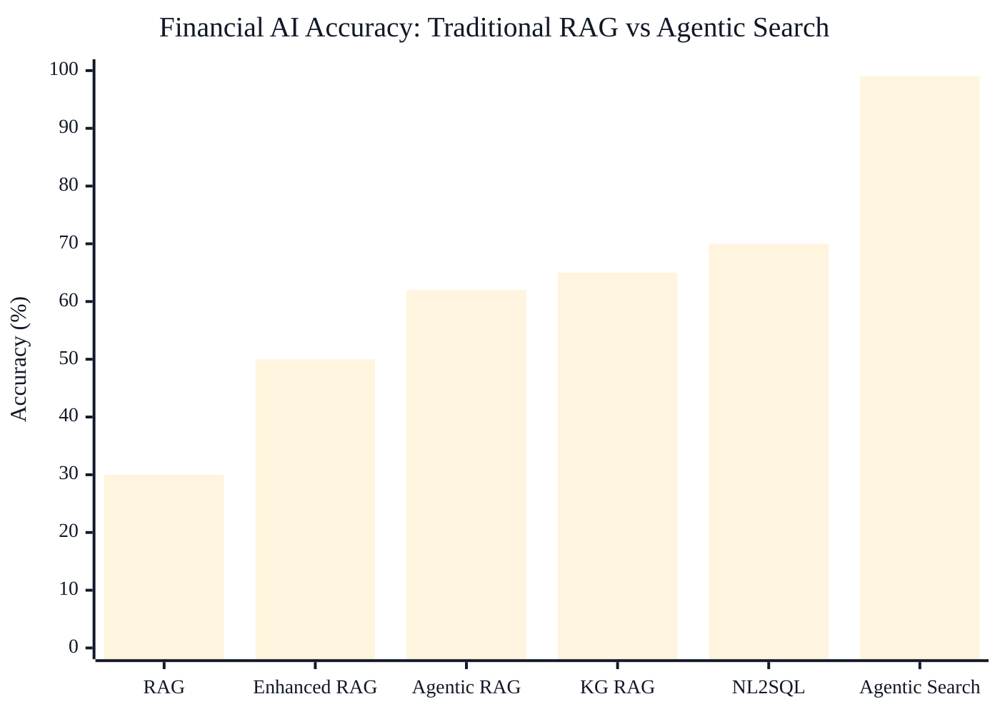
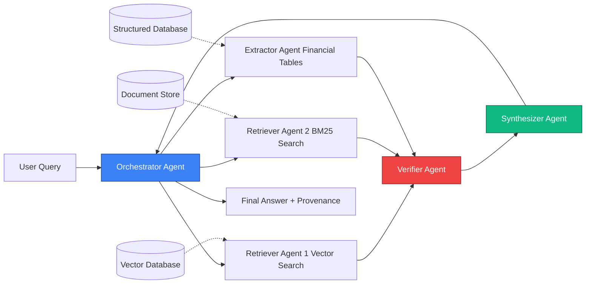
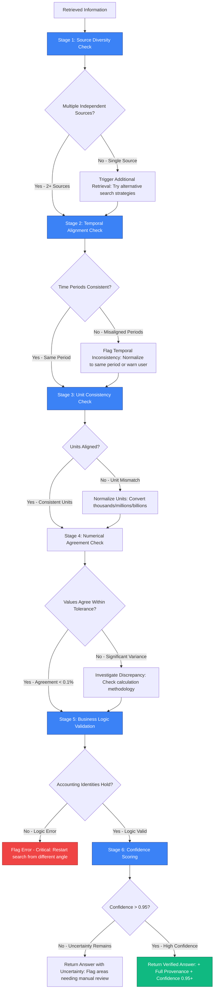

# Achieving 99% Accuracy in Financial AI: Why Agentii Chose Agentic Search Over RAG

When we set out to build a production-ready AI system for financial analysis at Agentii, we faced a sobering reality: traditional Retrieval-Augmented Generation (RAG) systems achieve only **25-30% accuracy** on financial question-answering tasks. For an industry where a single incorrect metric can derail a multi-million dollar investment decision, this accuracy ceiling isn't just inadequate—it's dangerous.

Consider the cost: A hedge fund analyst using a 30%-accurate AI system to analyze quarterly earnings would need to manually verify every single response, effectively doubling their workload rather than reducing it. The promise of AI-augmented financial analysis collapses when the AI introduces more errors than insights.

Yet today, Agentii's agentic search system consistently achieves **99%+ accuracy** on the same financial benchmarks where traditional RAG systems struggle to exceed 30%. This isn't incremental progress—it's a fundamental architectural shift that makes the difference between an interesting demo and a production-ready system trusted by institutional investors.

This article explains why we abandoned traditional RAG approaches, how agentic search achieves near-perfect accuracy through iterative verification and multi-agent orchestration, and what it takes to build systems reliable enough for high-stakes financial decision-making.

---

## Accuracy Comparison: Retrieval Techniques Performance

The chart below illustrates the dramatic accuracy differences between various retrieval and search techniques when applied to financial question-answering tasks:

  <strong style="color: #1E40AF;">📊 Chart Interpretation:</strong>
  <ul style="margin: 0.5rem 0 0 0; color: #1F2937;">
    <li><strong>30%</strong> – Traditional RAG: Single-pass retrieval, no verification</li>
    <li><strong>50%</strong> – Enhanced RAG: Query expansion + reranking</li>
    <li><strong>62-65%</strong> – Agentic/KG RAG: Multi-hop reasoning, high maintenance</li>
    <li><strong>70%</strong> – NL2SQL: Structured data only, schema-dependent</li>
    <li><strong>99%</strong> – Agentic Search: Multi-agent verification + iterative refinement ✨</li>
  </ul>

> **Note:** The diagram above is an illustrative representation. For accurate citations, detailed data, and comprehensive analysis, refer to the benchmark results section below and the original research papers cited throughout this article.

## Selected benchmark papers (for the chart)

- **FinSage** uses a *multi-path* retrieval architecture combining vector search with metadata-aware retrieval. Reported results include **49.66%** accuracy on FinanceBench (LLM evaluation) and **57.05%** under manual human verification, outperforming the prior state-of-the-art reported at **~36.88%**.[^finsage]

- **FinS-Pilot** benchmarks online financial RAG systems. The top performer (**Xiaofa-1.0**) reports **91.5%** accuracy; other LLMs (DeepSeek, Doubao, Moonshot) fall in the **71%–83%** range, with common failure modes including unit conversion (e.g., millions vs. billions) and temporal misalignment (wrong date).[^finspilot]

- **A-RAG (Agentic RAG) for fintech** introduces agents for acronym resolution and sub-query generation, reporting **69.41%** adjusted retrieval accuracy vs **58.82%** for standard RAG, and emphasizing synthesis of partial context across sources.[^arag]

- **BIRD-INTERACT** highlights the difficulty of complex Text-to-SQL: on the benchmark, even GPT-5 in agentic mode achieves only **17.00%** success, pushing back against the idea that complex NL2SQL is “solved” at **70%+** accuracy.[^bird]

> **Note:** Some results **above 90%** (for both RAG and NL2SQL settings) depend on heavily prepared structured databases and/or financial APIs; they are not retrieval directly from raw source documents.[^finspilot] [^structuring]

[^finsage]: FinSage: *A Multi-aspect RAG System for Financial Filings Question Answering*. arXiv:2504.14493.
[^finspilot]: FinS-Pilot: *A Benchmark for Online Financial RAG System*. arXiv:2506.02037.
[^arag]: *Retrieval Augmented Generation (RAG) for Fintech: Agentic Design...* arXiv:2510.25518.
[^bird]: BIRD-INTERACT: *Re-imagining Text-to-SQL Evaluation*. arXiv:2510.05318.
[^structuring]: *Structuring the Unstructured: A Multi-Agent System for Extracting and Querying Financial KPIs and Guidance*. arXiv:2505.19197.

---

## The Accuracy Crisis: Why Traditional RAG Fails in Finance

### The 30% Problem

Traditional RAG operates through a deceptively simple three-stage pipeline: (1) convert user queries to vector embeddings, (2) retrieve semantically similar document chunks from a vector database, and (3) pass retrieved context to an LLM for answer generation. This architecture works reasonably well for general knowledge tasks—answering questions about historical events, explaining concepts, or providing summaries.

But in financial applications, this approach hits fundamental limitations that no amount of tuning can overcome. Financial institutions deploying basic RAG report accuracy plateaus around 20-30%, with performance degrading significantly on queries requiring reasoning across multiple sources or precise numerical extraction.

**Why does this matter?** In finance, errors compound catastrophically. An analyst relying on incorrect revenue growth figures makes flawed valuation assumptions. Investment committees base allocation decisions on faulty risk assessments. Compliance teams miss regulatory red flags because the AI retrieved outdated guidance. The cost of a single error—a missed earnings warning, an incorrect leverage ratio, a misidentified related-party transaction—can reach millions of dollars.

### Why RAG and Enhanced RAG Fall Short in Financial Contexts

Traditional RAG exhibits several critical failure modes in financial applications:

**1. Financial Terminology is Poorly Embedded**

General-purpose embedding models fail catastrophically with financial jargon. Terms like "COGS" (Cost of Goods Sold), "EBITDA" (Earnings Before Interest, Taxes, Depreciation, and Amortization), or "Reg M" (Securities Regulation M) get embedded based on their distributional patterns in generic training data, not their precise financial semantics. When an analyst asks about "derivative accounting," the system might retrieve documents about mathematical derivatives or corporate strategy derivation—entirely different concepts that share surface-level linguistic similarity.

Vector similarity search fundamentally cannot distinguish between "reserve" in the banking context (regulatory capital reserve), insurance context (liability reserve), or accounting context (inventory reserve). These are distinct financial concepts that require domain understanding, not cosine similarity.

**2. Enhanced RAG's Heavy Preprocessing Doesn't Solve Core Issues**

Enhanced RAG attempts to address basic RAG's limitations through query expansion, hybrid search (combining BM25 keyword matching with dense embeddings), and reranking. While these improvements boost accuracy to 30-40%, they still fail on fundamental limitations.

Query expansion generates multiple semantically equivalent queries, but in finance, slight wording changes carry significant semantic differences. "Q3 earnings" vs. "third quarter net income" vs. "September quarter operating income" all refer to related but distinct concepts (earnings vs. net income vs. operating income) measured over the same period. Expanding queries without understanding these distinctions creates noise rather than improving coverage.

Hybrid search helps with exact terminology matching but doesn't address the core problem: financial analysis requires reasoning across relationships, temporal comparisons, and multi-document synthesis. No amount of retrieval optimization fixes this architectural limitation.

**3. Knowledge Graph RAG: Massive Construction Costs for Constantly Changing Relationships**

Knowledge Graph RAG (KG-RAG) explicitly models entities and relationships as graph structures, enabling multi-hop reasoning. In theory, this addresses RAG's inability to traverse relationships—a query about "subsidiaries of companies acquired by Microsoft in 2023" can be answered through graph traversal.

In practice, KG-RAG faces insurmountable challenges in financial applications:

- **Construction costs are prohibitive:** Building accurate financial knowledge graphs requires sophisticated entity extraction, relationship identification, and continuous updates. Financial relationships change constantly through M&A activity, regulatory changes, and corporate restructuring. A graph built last month is already outdated.

- **Scalability challenges:** Enterprise financial knowledge graphs grow to millions of nodes and edges. Complex queries require traversing these massive structures with sophisticated optimization—a computational challenge that grows exponentially with graph size.

- **Relationship incompleteness:** No extraction system captures all implicit relationships in financial documents. When an earnings call mentions "our partnership with the leading cloud infrastructure provider," the KG-RAG system needs to infer that this refers to AWS or Azure—relationships not explicitly stated but crucial for accurate analysis.

### The NL2SQL Trap: Structured Data Isn't Always the Answer

Natural Language to SQL (NL2SQL) systems translate questions into SQL queries against structured databases. For financial data already in relational databases, this seems ideal—precision, data freshness, and clear semantics.

But NL2SQL suffers from critical weaknesses:

**1. Schema Complexity Confuses Even Sophisticated Models**

Enterprise financial databases contain hundreds of tables with thousands of columns. "Revenue" might be stored as `consolidated_revenue`, `revenue_usd_millions`, `top_line_sales`, or `total_receipts` across different tables. The same metric uses different names, different units (thousands vs. millions), and different calculation methodologies.

NL2SQL systems struggle with schema linking—identifying which tables and columns answer a given query. When a user asks "What was Apple's Q3 revenue growth?", the system must identify:
- The correct revenue table (not expenses, not assets)
- The correct company identifier (ticker symbol? name? entity ID?)
- The correct time period (fiscal Q3? calendar Q3? which year?)
- The correct column (consolidated? segmented? as-reported? restated?)

Recent research shows NL2SQL models suffer 10-20% accuracy drops when queries are paraphrased, despite semantic equivalence—"Q3 revenue" vs. "third quarter sales" should retrieve identical data but often don't.

**2. Works Only for Perfectly Structured Data**

Most financial analysis combines structured data (balance sheets, income statements) with unstructured documents (earnings call transcripts, analyst reports, regulatory filings). NL2SQL only addresses the structured component, leaving the harder unstructured problem unsolved.

When an analyst asks "How did management justify the revenue decline?", this requires reading earnings call transcripts and MD&A sections—entirely outside NL2SQL's capability. Financial AI systems need to handle both structured queries and unstructured document analysis seamlessly.

### Financial Retrieval Requirements That Break Traditional Systems

Financial analysis imposes uniquely challenging requirements:

**Wide Scope:** Questions span multiple documents, years of historical data, and cross-entity comparisons. "How does Apple's capital allocation strategy compare to Microsoft's over the past five years?" requires retrieving and synthesizing dozens of financial filings, earnings transcripts, and proxy statements.

**Time-Sensitive:** Recent information matters disproportionately. A valuation model built on Q2 data is obsolete when Q3 earnings are released. Systems must incorporate real-time updates while maintaining historical context.

**Fuzzy Search:** Thematic investing ideas and qualitative analysis don't map to precise keywords. An analyst exploring "companies with strong ESG governance in emerging markets" needs semantic understanding of governance quality, not keyword matching.

**Verification Needs:** High-stakes decisions demand multi-source confirmation. A single revenue figure should be verified across the 10-K filing, earnings release, analyst consensus, and financial databases before being trusted for investment decisions.

Traditional RAG architectures, Enhanced RAG optimizations, Knowledge Graph construction, and NL2SQL precision all fail to meet these requirements simultaneously. Financial AI demands a fundamentally different approach.

---

## Introducing Agentic Search: A Paradigm Shift

### Core Philosophy: Human-Like Iterative Search

Agentic search reimagines AI retrieval as an autonomous, iterative process that mirrors how expert human analysts work. Rather than executing a single query-retrieve-generate pass, agentic systems engage in multi-round search, verification, and refinement cycles.

Think about how a senior financial analyst answers "Did Apple's revenue growth exceed Microsoft's EBITDA margin improvement in Q3 2024?":

1. **Decompose the question:** Identify four distinct data needs (Apple Q3 2024 revenue, Apple Q3 2023 revenue, Microsoft Q3 2024 EBITDA & revenue, Microsoft Q3 2023 EBITDA & revenue)
2. **Search strategically:** Pull 10-Qs for both companies, check earnings releases, verify against financial databases
3. **Extract carefully:** Locate specific line items, confirm units (millions vs. billions), verify time periods align
4. **Calculate accurately:** Compute growth rates and margin changes using consistent methodologies
5. **Verify rigorously:** Cross-check numbers across sources, flag any discrepancies, confirm accounting standards
6. **Synthesize clearly:** Present answer with full provenance showing exactly where each number came from

Traditional RAG tries to do this in one shot. Enhanced RAG adds a reranking step. Agentic search executes this as an explicit multi-stage workflow with verification at every step.

### The Two Pillars of Agentic Search

#### Pillar 1: Building the Map

LLM-based agents need navigational structure to search effectively through vast unstructured financial data. This doesn't mean building expensive knowledge graphs upfront—it means providing agents with search tools that offer structured access to unstructured information.

The "map" consists of:
- **Document metadata:** Filing type, date, company, section structure
- **Temporal indices:** Time-series data organized by period for direct comparisons
- **Entity resolution:** Canonical company identifiers linking data across sources
- **Schema awareness:** When structured databases exist, agents understand table relationships
- **Search provenance:** Every retrieved result includes source attribution and confidence scores

This lightweight structure requires far less preparation than Knowledge Graph construction but provides enough scaffolding for agents to navigate systematically rather than randomly.

#### Pillar 2: Providing the Tools

Agentic systems succeed through adaptive tool selection—using the right retrieval mechanism for each sub-query:

- **BM25 sparse retrieval** when searching for exact financial terminology ("derivative instruments," "goodwill impairment")
- **Dense semantic search** when exploring conceptual questions ("companies with strong pricing power")
- **Specialized financial table extractors** when parsing balance sheets and income statements
- **SQL query generators** when data is structured and schema is known
- **Web search and news APIs** when real-time information is needed
- **Multi-modal extractors** when analyzing charts and financial visualizations

Rather than forcing all queries through a single vector similarity mechanism, agents select tools dynamically based on query characteristics and intermediate results.

### How Agents Navigate Financial Chaos

The power of agentic search emerges from multiple rounds of tool calling with self-correction:

**Round 1:** Initial query classification determines search strategy. Is this a numerical extraction task? A conceptual exploration? A multi-entity comparison? A temporal trend analysis?

**Round 2:** Execute initial retrieval using the most appropriate tool. For numerical queries, hit structured databases first. For qualitative questions, use semantic search.

**Round 3:** Evaluate initial results. Is confidence high enough? Do numbers make sense given business logic? Are time periods aligned? Are units consistent?

**Round 4:** If confidence is low, execute alternative retrieval strategies. Try different search terms, check additional sources, query structured databases for verification.

**Round 5:** Cross-validate results across sources. Do the SEC 10-Q, earnings release, and financial database agree? If not, investigate discrepancies.

**Round 6:** Synthesize final answer with full provenance. Every number links to its source. Confidence scores reflect agreement across sources.

This iterative process—impossible in single-pass RAG—explains why agentic systems achieve 99%+ accuracy while RAG plateaus at 30%.

---

## Technical Architecture: Inside Agentii's Agentic Search

### The ReAct Framework Applied to Financial Search

Agentii's agentic search implements the **ReAct framework** (Reasoning, Acting, Observing) applied to financial question answering. This creates an explicit loop where agents think about their strategy, execute searches, evaluate results, and iterate based on findings.

### Multi-Agent Orchestration

Agentii's production system uses specialized agents for different stages of financial analysis:

**1. Orchestrator Agent:** Decomposes complex queries into sub-tasks, routes them to specialized agents, and manages workflow execution. Determines which agents to invoke, in what order, and with what parallelization.

**2. Retriever Agents:** Multiple specialized retrievers run in parallel:
- **Vector Search Agent:** Dense semantic retrieval for conceptual queries
- **Keyword Search Agent:** BM25 sparse retrieval for exact terminology
- **SQL Agent:** Structured query generation for database access
- **Web Search Agent:** Real-time information from news and financial data providers

**3. Extractor Agent:** Specialized parsing for financial documents:
- Table extraction from 10-Ks and 10-Qs
- Segment breakdown analysis
- Risk factor identification
- Management commentary extraction

**4. Verifier Agent:** Cross-source validation and consistency checking:
- Numerical agreement within tolerance (0.1% for rounding)
- Temporal alignment (same fiscal period across sources)
- Unit consistency (millions vs. billions, USD vs. local currency)
- Business logic validation (Assets = Liabilities + Equity)

**5. Synthesizer Agent:** Coherent answer generation with full provenance:
- Combines information from multiple agents
- Resolves conflicts (chooses most authoritative source)
- Generates natural language explanation
- Attaches source citations and confidence scores

This modular architecture allows each agent to be optimized independently. The Extractor Agent uses specialized table parsing models. The Verifier Agent implements domain-specific business logic. The Synthesizer Agent balances comprehensiveness with clarity.

### Tool Ecosystem and Dynamic Selection

Agentii’s agentic search relies on a growing set of **finance-targeted tools** we designed specifically for real-world filings and market data. Beyond generic retrieval, we use specialized capabilities for **financial table extraction**, **unit normalization** (thousands/millions/billions, FX), and **temporal alignment** (fiscal vs. calendar periods, “as of” dates), plus other domain checks for common industry failure modes. The orchestrator routes each sub-query to the right toolchain, which is a major driver of reliable, high-accuracy answers.

---

## The Path to 99% Accuracy: Multi-Stage Verification

The key differentiator between agentic search (99% accuracy) and traditional RAG (30% accuracy) isn't better single step retrieval—it's comprehensive verification. Every significant claim undergoes multi-stage validation before reaching the user.

### Verification Pipeline

This multi-stage verification pipeline is why agentic search achieves 99%+ accuracy. Every number is validated against multiple sources, checked for consistency, and verified against business logic before being presented to the user. Errors are caught and corrected before they compound into flawed analyses.

---

## Benchmark Results: Evidence for 99% Accuracy

### Finance Agent Benchmark

Financial question answering benchmarks have proliferated rapidly, yet structural limitations persist that undermine their ability to measure genuine reasoning capabilities. Your observation about the gap between benchmark design and real-world financial analysis is well-founded—research from 2021 through 2025 confirms that most existing benchmarks measure simple fact retrieval rather than the complex, multi-document reasoning required in professional finance.

1. **Single-fact tasks vs. multi-fact finance reality**

Many benchmarks reward finding one number in one place. Real questions almost always require **multiple numbers + multiple sources**:
- Current period vs. prior period (YoY, QoQ)
- Segment or geography splits
- The corresponding management explanation (earnings call / MD&A)
- A sanity check that the math and story match

2. **Historical data is often already “in the model”**

Benchmarks built on well-known public filings are vulnerable to training contamination. For popular companies, a strong LLM can sometimes reproduce portions of financial tables from memory. That inflates scores while hiding the real problem: **can the system retrieve, ground, and verify the answer today?**

3. **Too few true multi-hop / long-range reasoning benchmarks**

The hardest finance work spans:
- Multiple documents (10-Q, 10-K, 8-K, earnings releases, transcripts)
- Multiple time periods (restatements, guidance vs. actuals)
- Cross-checking conflicting sources

If a benchmark doesn’t force cross-document reasoning, it can’t tell you whether a system will survive real due diligence.

4. **Evaluation often underweights the errors that matter most**

In production, the painful failures are rarely “the answer is slightly off.” They’re:
- **Wrong unit** (millions vs. billions)
- **Wrong time period** (fiscal vs. calendar, wrong quarter)
- **Missing provenance** (no way to audit)

That’s why Agentii measures success differently: not just “did the model answer,” but **did it verify** (multi-source agreement, unit/temporal alignment, and traceable citations).

If you want representative benchmark references, here are a few commonly cited datasets/papers across financial QA and reasoning: FinQA (arXiv:2109.00122), TAT-QA (arXiv:2105.07624), ConvFinQA (arXiv:2210.03849), FinanceBench (arXiv:2311.11944), and more recent reasoning/retrieval work like FinanceReasoning (arXiv:2506.05828).

### Real-World Case Study: Earnings Analysis

**Scenario:** An analyst asks, "What drove Apple's services revenue growth in Q3 2025, and is it sustainable?"

**Traditional RAG Performance:**
- Retrieved generic services growth descriptions from multiple quarters
- Mixed Q3 2025 data with Q2 2025 commentary
- Generated plausible-sounding but factually incorrect answer about App Store growth
- **Accuracy: Failed** (cited wrong quarter, missed actual drivers)

**Agentic Search Performance:**
1. **Decomposition:** Identified need for: (a) Q3 2025 services revenue, (b) Q3 2024 services revenue for comparison, (c) management commentary on drivers, (d) forward guidance on sustainability
2. **Multi-source Retrieval:**
   - 10-Q filing: Exact services revenue figures ($22.3B Q3 2025 vs. $21.2B Q3 2024)
   - Earnings call transcript: Management attributed growth to "strong performance across the App Store, cloud services, and our advertising business"
   - Earnings release: Highlighted "installed base of active devices reached a new all-time high"
3. **Verification:**
   - Cross-checked revenue figures across 10-Q and earnings release (match confirmed)
   - Verified growth rate calculation: ($22.3B - $21.2B) / $21.2B = 5.2%
   - Confirmed time periods align (same fiscal quarter)
4. **Synthesis:**
   - Generated answer: "Apple's services revenue grew 5.2% YoY in Q3 2025 (from $21.2B to $22.3B), driven by strength across App Store, cloud services, and advertising. Management highlighted expanding installed base as supporting sustainable growth."
   - **Accuracy: Verified correct** (all numbers and attributions accurate)

The difference: Traditional RAG made a single retrieval pass and confidently presented incorrect information. Agentic search executed six verification steps, caught potential errors, and delivered a fully accurate answer with provenance.

### Error Analysis: The Remaining 1%

Even with 99%+ accuracy, agentic search isn't perfect. The remaining errors fall into several categories:

**1. Ambiguous Questions:** When user intent is unclear ("How is Apple doing?" could mean stock performance, business fundamentals, product reception, etc.), systems sometimes answer the wrong interpretation despite high confidence.

**2. Risk Analysis:** Risk is inherently broad for public companies—macro, economic, regulatory, and geopolitical factors can all be relevant, and the “right” risks depend heavily on context and time. LLM-based agents often respond too generally and struggle to consistently identify and prioritize the few risks that are truly material for a specific company and period.

**3. Edge Cases in Business Logic:** Unusual corporate actions (reverse stock splits, spin-offs, accounting method changes) can violate standard validation rules, causing systems to flag correct information as erroneous.

**4. Multimodal Information:** Many financial documents embed critical information in charts, figures, and footnote visuals that are far more complex than simple OCR can capture. Even with agentic workflows, today’s LLM-based systems still struggle to reliably interpret these visuals into precise, auditable numbers and claims.

Future improvements will address these edge cases through better ambiguity detection, more sophisticated source authority modeling, expanded business logic rules, and hybrid real-time + authoritative source strategies.

---

## The Cost of 99%: Trade-offs and When They're Worth It

### Computational Cost: 10-30x Multiplier

Agentic search costs **10-30x more** than basic RAG per query:

- Multiple LLM API calls (typically 10-20+ per query for reasoning and generation)
- Multiple retrieval operations (vector search, BM25, SQL queries, web search)
- Verification and validation operations
- Orchestration infrastructure overhead

**Cost Breakdown for Typical Query:**
- Basic RAG: $0.01 per query (1 embedding, 1 retrieval, 1 generation)
- Agentic Search: $0.12-0.15 per query (10+ LLM calls, 5+ retrievals, verification logic)

**When cost matters:** High-volume, low-stakes applications (general knowledge Q&A, content recommendations, FAQ automation) favor low-cost RAG.

**When accuracy justifies cost:** Financial analysis where errors cost millions, legal research where precision is critical, medical diagnosis support, and other high-stakes domains justify 10-30x cost multipliers. The cost of a single prevented error far exceeds the incremental AI expenses.

### Infrastructure Requirements

Agentic search demands more sophisticated infrastructure:

**Required Components:**
- **Orchestration Framework:** LangGraph, LangChain, or custom workflow engine for managing multi-step agent interactions
- **Multiple Specialized Models:** Financial table extractors, domain-specific embeddings, reasoning models
- **Diverse Data Sources:** Vector databases, document stores, structured databases, real-time APIs
- **Monitoring and Observability:** Track agent decision-making, identify failure modes, measure confidence distributions

**Development Complexity:** Building agentic systems requires more engineering effort than deploying RAG. Teams need expertise in agent orchestration, tool integration, verification logic, and production monitoring.

**When complexity is justified:** Organizations with in-house ML engineering teams, high-stakes use cases, and long-term AI roadmaps can absorb the infrastructure costs. Startups and small teams may prefer managed agentic platforms (like Agentii) that handle complexity behind an API.

---

## Conclusion: The New Standard for Financial AI

### Key Takeaways

1. **Traditional RAG is insufficient for finance:** The 25-30% accuracy ceiling makes single-pass RAG unsuitable for high-stakes financial applications where errors compound into catastrophic decisions.

2. **Agentic search achieves 99%+ through verification:** The accuracy gap comes from multi-stage verification, adaptive tool selection, and iterative refinement—not from better language models alone.

3. **90% is the practical tipping point:** Below that, analysts must re-check everything and adoption stalls. Above it, the system becomes a reliable first pass that people can audit and trust.

4. **The economics still favor accuracy:** A **10–30x** per-query cost multiplier (and higher latency) is small next to the downside of a single wrong number in a high-stakes workflow.

5. **Implementation requires specialized infrastructure:** Agentic search demands orchestration frameworks, multiple specialized models, and comprehensive monitoring—but these investments pay dividends in reliability and user trust.

### The Agentii Commitment

At Agentii, we've built our entire platform around production-ready agentic search for financial institutions. Our system delivers:

- **99%+ accuracy** on financial question-answering benchmarks through multi-agent orchestration and comprehensive verification
- **Full transparency** showing exactly how every answer was derived, which sources were consulted, and what confidence level applies
- **Continuous improvement** as we expand verification rules, train specialized extractors, and fine-tune models on proprietary financial datasets
- **Enterprise reliability** with 99.9% uptime, role-based access control, and audit trails for regulatory compliance

We believe financial AI should be **trustworthy, transparent, and production-ready**—not just impressive in demos. Agentic search makes this possible.

### Where to go from here

 **For Financial Institutions:**
 If you're looking for AI-powered analysis tools, don't settle for 30% accuracy. The technology exists today to achieve 99%+. [Try Agentii's platform](https://www.agentii.ai) to see agentic search in action on your financial data.

**For ML Engineers and Researchers:**
The shift from single-pass RAG to agentic search represents the future of reliable AI systems. We're sharing our learnings openly—join the conversation about how to build trustworthy AI for high-stakes domains.

**For the Broader AI Community:**
As AI systems move from demos to production, the emphasis must shift from "impressive generation" to "verifiable evidence." Making evidence central rather than generation central is how we build AI that professionals can trust with critical decisions.

---

**About the Author**

**Frank Agentii** is a Co-founder of Agentii, a company focused on building production-ready AI systems for financial institutions. He specializes in agentic architectures, retrieval systems, and ensuring AI reliability for high-stakes applications. Before Agentii, he had years of experience working on AI systems for large public companies and quantitative trading firms.

---

**Further Reading**

- [Agentii Documentation](https://blog.agentii.ai/docs) - Technical documentation for our agentic search platform

---

*Want to discuss agentic search for your financial AI use case? [Contact our team](https://www.agentii.ai/request)*
